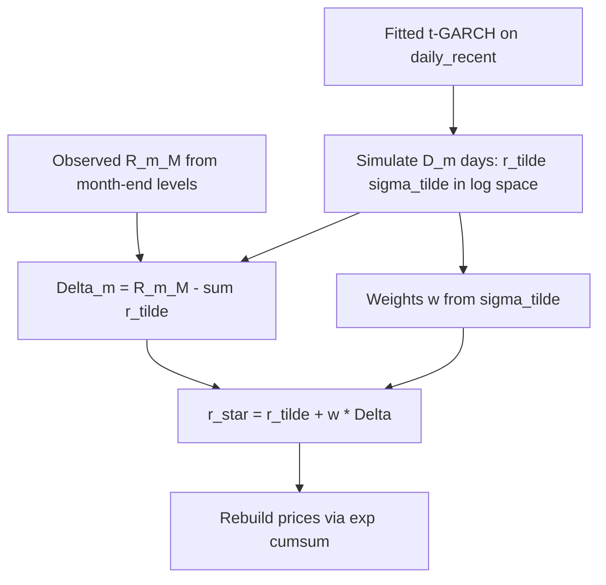

# PARTB_2 workflow with fitted t-GARCH and standardized residuals

## How the solution text maps to your fit object

You already have `garch = fit_t_garch_on_daily_recent(daily_recent)` returning `[TGarchFitResult](partb.py)` with:

- `garch.fit` — `arch` `ARCHModelResult` (parameters, `model`, etc.)
- `garch.scale` — e.g. `100` (estimation on `endog = 100 * log_return`)
- `garch.conditional_volatility` — **already in log-return units** (÷ scale)
- `garch.standardized_residuals` — in-sample \hat z_t = \hat\varepsilon_t / \hat\sigma_t

The PARTB_2 steps are **month-by-month** over the **40-year month-end** segment (`monthly_early` from `[build_part_b_split](partb.py)`): for each calendar month m you know **observed** month-end levels M_m, M_{m+1} and you need **D_m** trading days in that month (from historical calendar structure—same month lengths as in your CSV construction, or from a trading-day count table per month).

---

## Step-by-step (lines 32–39)

1. **Observed monthly log return**
  R_m^{(M)} = \log(M_{m+1}/M_m) using **actual** month-end closes from `monthly_early` (aligned so M_m is last trading day of month m).
2. **Simulate (\tilde r_{m,j}, \tilde\sigma_{m,j})** for j=1,\ldots,D_m
  Use the **same** model as estimation, in **scaled** space, then convert back to log-return units to match R_m^{(M)}:
  - Call simulation on the **fitted model**, not on raw arrays in isolation:  
  `sim = garch.fit.model.simulate(garch.fit.params, nobs=D_m, burn=..., initial_value_vol=...)`  
  (`[arch` returns a DataFrame with columns `data`, `volatility`, `errors](.venv/lib/python3.9/site-packages/arch/univariate/mean.py)`—`data` and `volatility` are in the **same units as `endog`**, i.e. **scaled** log returns).
  - Set \tilde r_{m,j} = \text{sim['data']}*j / garch.scale and \tilde\sigma*{m,j} = \text{sim['volatility']}_j / garch.scale so they are **daily log returns** and **conditional vol of log returns**, consistent with R_m^{(M)}.
   **Initialization across months:** each new month simulation should either use a **burn** period (default in `arch` is large) and/or pass `initial_value_vol` tied to **unconditional variance** or the **last** simulated \sigma if you chain days continuously—document one convention and stick to it.
3. **\tilde R_m = \sum_j \tilde r_{m,j}**, **\Delta_m = R_m^{(M)} - \tilde R_m**.
4. **w_{m,j} = \tilde\sigma_{m,j} / \sum_k \tilde\sigma_{m,k}** (use **pre-correction** \tilde\sigma as in the text).
5. **r^*_{m,j} = \tilde r_{m,j} + w_{m,j}\Delta_m**.
  Then \sum_j r^*_{m,j} = R_m^{(M)} (weights sum to 1).
6. **Reconstruct daily prices** within the month from r^*: e.g. pick a starting level P_{m,0}=M_m, then P_{m,j} = P_{m,j-1}\exp(r^{m,j}); last day should reproduce M*{m+1} up to numerical tolerance.
7. **Monte Carlo (line 40–41):** repeat steps 2–6 many times with **new random simulation draws**; aggregate drawdowns / percentiles over paths.

---

## Where do **standardized t residuals** go?

**Inside the written algorithm, they are implicit in step “Simulate from fitted t-GARCH.”**  
Each simulated day is driven by a **new** standardized innovation z_t (Student‑t with estimated \nu); \tilde\varepsilon_t = \tilde\sigma_t z_t. You do **not** need to plug `garch.standardized_residuals` into that step unless you choose a **bootstrap** scheme.

| Role                              | Use of standardized residuals                                                                                                                                                                                                                                                                                           |
| --------------------------------- | ----------------------------------------------------------------------------------------------------------------------------------------------------------------------------------------------------------------------------------------------------------------------------------------------------------------------- |
| **Default parametric simulation** | **Not required.** `simulate()` draws fresh z_t from the **fitted** t(\hat\nu).                                                                                                                                                                                                                                          |
| **Bootstrap / resampling**        | **Optional:** resample with replacement from `**garch.standardized_residuals.values`** and feed them through the **GARCH variance recursion** with fixed \hat\omega,\hat\alpha,\hat\beta (and mean) instead of drawing new t shocks—preserves **empirical** tail shape. More implementation work than `model.simulate`. |
| **Diagnostics**                   | **Already used** in `[compare_garch_orders](partb.py)` (Ljung–Box on \hat z_t^2); checks that variance spec is reasonable before trusting simulation.                                                                                                                                                                   |

So: **for PARTB_2 as written, you mainly use `garch.fit` + `garch.scale` for simulation; `standardized_residuals` are for diagnostics and optionally for a bootstrap variant.**

---

## Pitfalls to keep explicit in code/comments

- **One scaling convention:** simulation outputs must be **÷ `garch.scale`** before comparing to R_m^{(M)} or using `conditional_volatility`-style weights.
- **Constant mean:** your fit uses `Constant`; simulated `data` includes \hat\mu in scaled units—still handled if you use `fit.model.simulate(fit.params, ...)`.
- **Comparing to Part (a):** if Part (a) uses **simple** returns for risk metrics, convert simulated log returns with `**np.expm1`** when you need simple-return objects—orthogonal to the monthly **sum** of log returns matching R^{(M)}.

---

## Suggested implementation location (when you implement)

- New helpers in `[partb.py](partb.py)` or `partb_sim.py`: e.g. `simulate_monthly_bridge(monthly_early, garch: TGarchFitResult, n_paths, rng=...)` returning arrays or DataFrames of corrected daily log returns / levels per path.
- [`Part(b).ipynb](Part(b).ipynb): call after` fit_t_garch_on_daily_recent`/`compare_garch_orders`’s` chosen_fit`.

No change to the **plan file** you attached earlier; this is the simulation layer that sits on top of the existing fit.